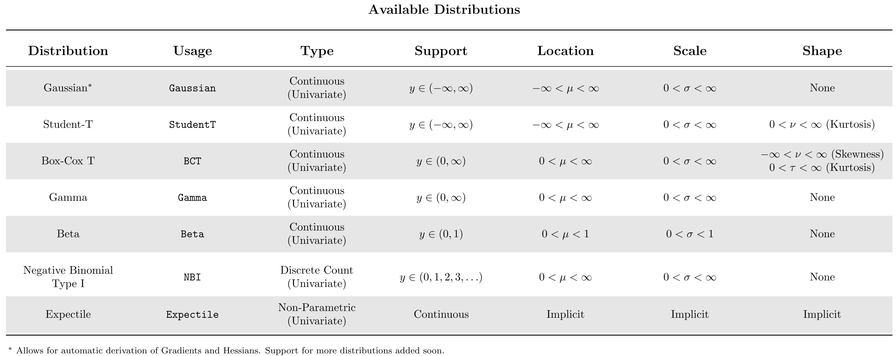

# Py-BoostLSS: An extension of Py-Boost to probabilistic modelling

We present a probabilistic extension of the recently introduced [Py-Boost](https://github.com/sb-ai-lab/Py-Boost) approach and model all moments of a parametric multivariate distribution as functions of covariates. This allows us to create probabilistic predictions from which intervals and quantiles of interest can be derived. 

## Motivation

Existing implementations of Gradient Boosting Machines, such as [XGBoost](https://github.com/dmlc/xgboost) and [LightGBM](https://github.com/microsoft/LightGBM), are mostly designed for single-target regression tasks. While efficient for low to medium target-dimensions, the computational cost of estimating them becomes prohibitive in high-dimensional settings. 

As an example, consider modelling a multivariate Gaussian distribution with `D=100` target variables, where the covariance matrix is approximated using the Cholesky-Decomposition. Modelling all conditional moments (i.e., means, standard-deviations and all pairwise correlations) requires estimation of `D(D + 3)/2 = 5,150` parameters. Because most GBM implementations are based on a *one vs. all estimation strategy*, where a separate tree is grown for each parameter, estimating this many parameters for a large dataset can become computationally extremely expensive. 

The recently introduced [Py-Boost](https://github.com/sb-ai-lab/Py-Boost) approach provides a more runtime efficient GBM implementation, making it a good candidate for estimating high-dimensional target variables in a probabilistic setting. Borrowing from the original paper [SketchBoost: Fast Gradient Boosted Decision Tree for Multioutput Problems](https://openreview.net/forum?id=WSxarC8t-T), the following figure illustrates the runtime-efficiency of the Py-Boost model.

<p align="center">

</p>

Even though the original implementation of Py-Boost also supports estimation of univariate responses, Py-BoostLSS focuses on multi-target probabilistic regression settings. For univariate probabilistic GBMs, we refer to our implementations of [XGBoostLSS](https://github.com/StatMixedML/XGBoostLSS) and [LightGBMLSS](https://github.com/StatMixedML/LightGBMLSS).

## Installation

Since Py-BoostLSS is GPU-based, we first need to install the corresponding PyTorch and CuPy packages. You can check your cuda version with `nvcc --version`.

```python
# Replace with your cuda version
pip install cupy-cuda11x

# Replace with your cuda version
pip3 install torch --extra-index-url https://download.pytorch.org/whl/cu11x
```

Next, you can install Py-BoostLSS.

```python
pip install git+https://github.com/StatMixedML/Py-BoostLSS.git 
```

## How to use
We refer to the [examples section](https://github.com/StatMixedML/Py-BoostLSS/tree/main/examples) for example notebooks.

## Available Distributions
At this time, Py-BoostLSS supports the following distributions. More distribution will follow soon.




## Feedback
Please provide feedback on how to improve Py-BoostLSS, or if you request additional distributions to be implemented, by opening a new issue or via the discussion section.


## Acknowledgements

The implementation of Py-BoostLSS relies on the following resources:

- [Py-boost: a research tool for exploring GBDTs](https://github.com/sb-ai-lab/Py-Boost)
- [SketchBoost: Fast Gradient Boosted Decision Tree for Multioutput Problems](https://openreview.net/forum?id=WSxarC8t-T)

We genuinely thank the original authors [Anton Vakhrushev](https://www.kaggle.com/btbpanda) and [Leonid Iosipoi](http://iosipoi.com/) for making their work publicly available. 

## Reference Paper
März, Alexander (2022) [*Py-BoostLSS: An extension of Py-Boost to probabilistic modelling*](). <br/>
<br />
März, Alexander (2022) [*Multi-Target XGBoostLSS Regression*](https://arxiv.org/abs/2210.06831). <br/>
<br />
März, A. and Kneib, T. (2022) [*"Distributional Gradient Boosting Machines"*](https://arxiv.org/abs/2204.00778). <br/>
<br />
März, Alexander (2019) [*XGBoostLSS - An extension of XGBoost to probabilistic forecasting*](https://arxiv.org/abs/1907.03178).
